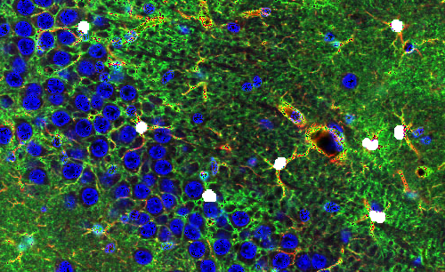
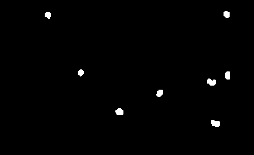
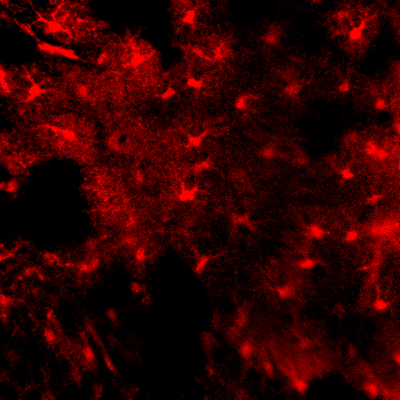
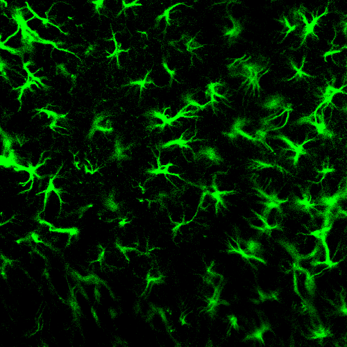
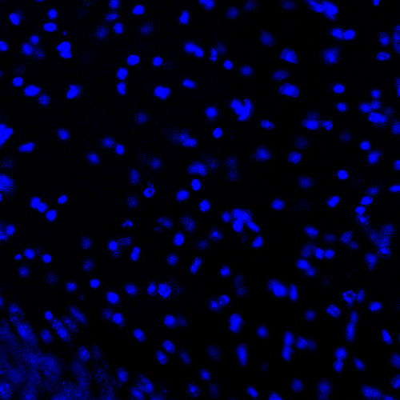
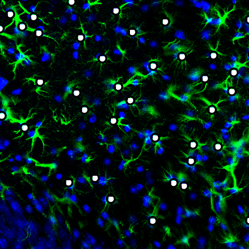

# AICellCounter
A machine learning-based automated cell counting tool requiring only one image for training

## Download the tool, unzip it, and use it

[Baidu 百度网盘](https://pan.baidu.com/s/1kSYSPcvQfDTtADW_Ku8rrA)    password: ```2333```

[OneDrive](https://connecthkuhk-my.sharepoint.com/:f:/g/personal/wangad_connect_hku_hk/EkCZtVlpJZhOvybOzxiditsBCzMJxWDVIOcbfUblaHG2cQ?e=jVV373)    password: ```2333```

<div align="center">
        
</div>

## Project background
An automated tool to identify the target cells in fluorescent images.

For a cell image with three channels: ```RGB```.

In the following example, red channel is a certain protein on the membrane; green channel is cytoskeleton; blue channel is nucleus.

<div align="center">
            
</div>

The target cells can be identified by one of the channel or the combination of them.

Users input a manually labeled image and AICellCounter can learn how to identify the target cells in similar images.

<div align="center">
    
</div>

## Contact
If you have any problems, please contact me with email: ```wangad@connect.hku.hk```.
